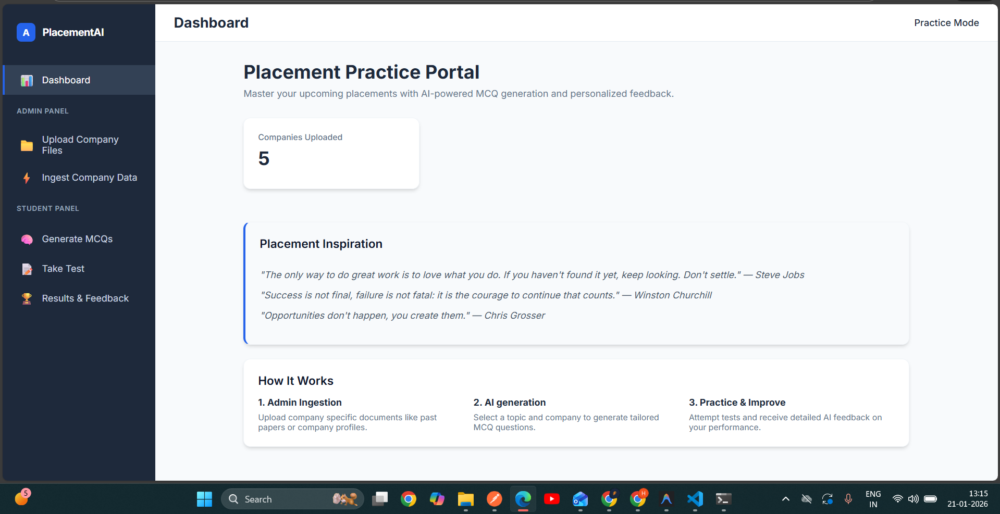
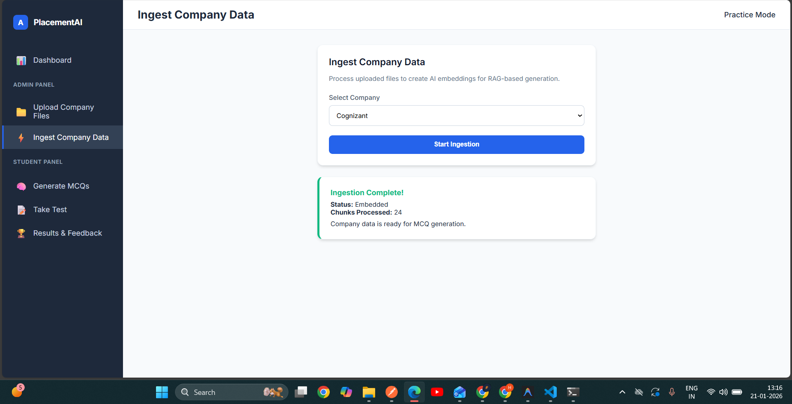
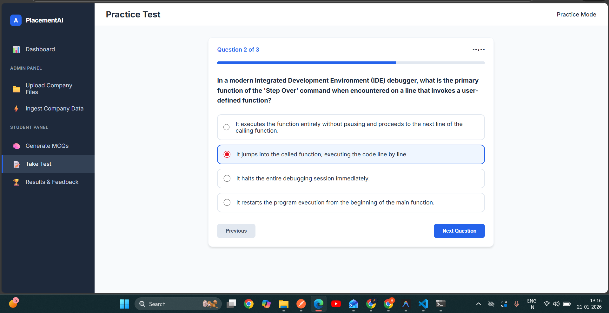
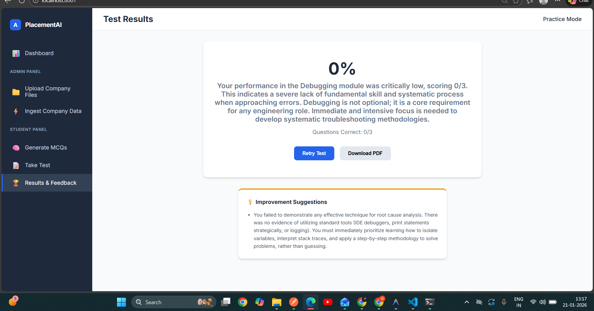
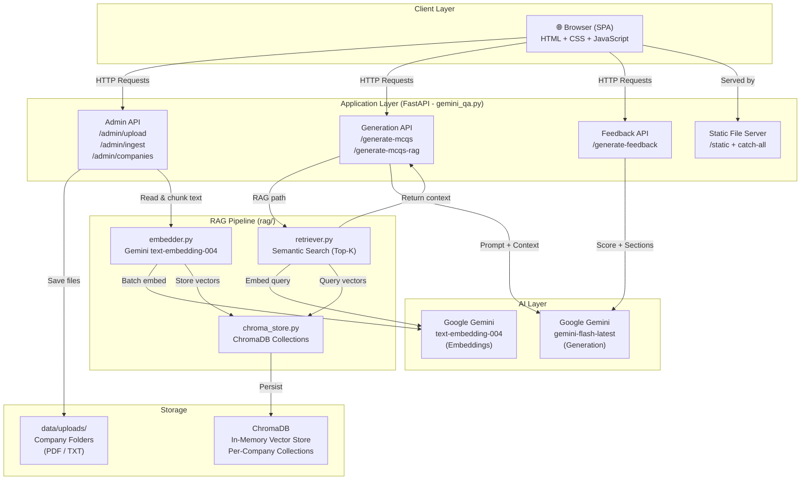
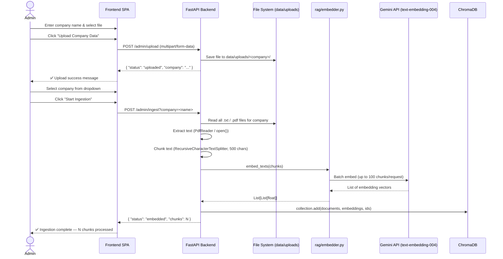
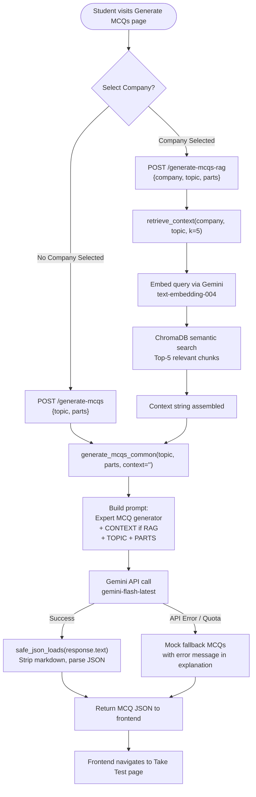
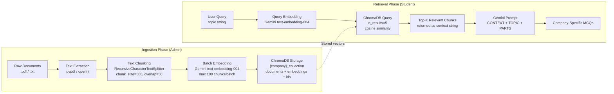
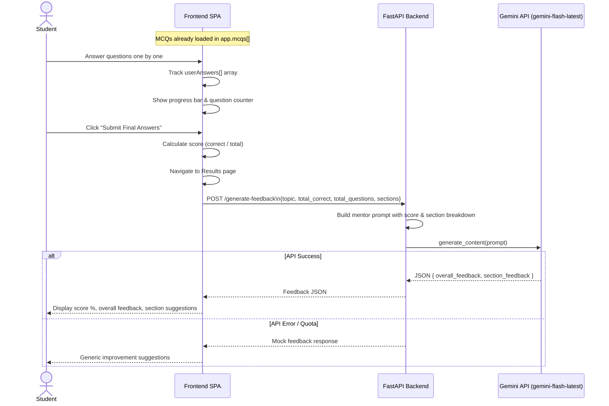
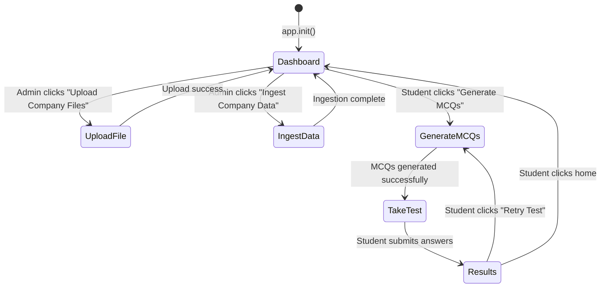

# AI-Based Placement Practice & MCQ Intelligence Platform

**AI-Based Placement Practice** is an interactive platform designed to help students prepare for placement tests using AI-generated MCQs. It leverages company-specific data to generate personalized quizzes and provides detailed feedback to identify strengths and weaknesses.

---
*Built by  ❤️  HARI KRISHNAN -A RAMCO INSTITUTE OF TECHNOLOGY -using FastAPI, Google Gemini AI, ChromaDB, and Vanilla JavaScript.*

## Features

### 1. Modern Dashboard
- High-level overview of key performance indicators.
- Clear explanation of the platform's utility.
- Professional UI with modern typography and interactive cards.



---

### 2. Admin Workflow
- **Company File Upload**: Supports document uploads with real-time feedback and loaders.
- **Data Ingestion**: Multi-step process for preparing uploaded data for RAG-based MCQ generation.
- Shows detailed processing stats for each data chunk.



---

### 3. Student Workflow
- **MCQ Generation**: Personalized questions by topic (Aptitude, English, Debugging) and company data.
- **Interactive Testing**: SPA-style test environment with progress tracking.
- **AI Feedback**: Post-test analysis highlighting strengths, weaknesses, and suggested improvements.



---

### 4. Verification & Navigation
- All sidebar links navigate correctly without page reloads (SPA behavior).
- Answers, scores, and page states are preserved during interactions.
- Forms handle simulated API latencies with loaders and status messages.



---

### 5. Visual Excellence
- Consistent **Inter typography**.
- Rounded corners (12px), soft shadows, and professional blue/gray/success palette.
- Hover states on interactive elements.
- Clean and modern UI for both admin and student workflows.

---

# AI-Driven Assessment & Weak Area Detection using RAG

> **An intelligent placement preparation platform** that uses Retrieval-Augmented Generation (RAG) and Google Gemini AI to generate company-specific MCQs, administer interactive tests, and deliver personalized performance feedback.

---

## Table of Contents

1. [Project Overview](#1-project-overview)
2. [Key Features](#2-key-features)
3. [System Architecture](#3-system-architecture)
4. [Technology Stack](#4-technology-stack)
5. [Project Structure](#5-project-structure)
6. [Workflow Diagrams](#6-workflow-diagrams)
   - [Admin Ingestion Workflow](#61-admin-ingestion-workflow)
   - [Student MCQ Generation Workflow](#62-student-mcq-generation-workflow)
   - [RAG Pipeline](#63-rag-pipeline)
   - [Test & Feedback Workflow](#64-test--feedback-workflow)
7. [API Reference](#7-api-reference)
8. [Frontend SPA Architecture](#8-frontend-spa-architecture)
9. [Setup & Installation](#9-setup--installation)
10. [Environment Variables](#10-environment-variables)
11. [Running the Application](#11-running-the-application)
12. [Screenshots](#12-screenshots)

---

## 1. Project Overview

This platform bridges the gap between generic placement preparation and company-specific readiness. Administrators upload company documents (PDFs, TXT files), which are processed into a vector database using Google Gemini embeddings. Students then select a company and topic to receive AI-generated MCQs that are contextually grounded in that company's actual placement patterns. After completing the test, the Gemini AI provides detailed, section-wise feedback highlighting weak areas.

### Problem Statement

Students preparing for placements often lack access to company-specific practice material. Generic MCQ platforms do not reflect the actual difficulty, style, or domain focus of individual companies. This platform solves that by:

- Allowing admins to upload real company documents as a knowledge base.
- Using RAG to retrieve relevant context before generating questions.
- Providing AI-driven, personalized feedback after each test.

---

## 2. Key Features

| Feature | Description |
|---|---|
| **Company-Specific MCQs** | RAG pipeline retrieves company context before generating questions |
| **General MCQ Mode** | Generate questions without company context for broad practice |
| **Multi-Section Tests** | Supports Aptitude, English, and Debugging sections |
| **Interactive SPA** | Single-page application with no page reloads |
| **AI Feedback Engine** | Post-test analysis with section-wise improvement suggestions |
| **Admin Panel** | Upload and ingest company documents via the UI |
| **Mock Fallback Mode** | Graceful degradation when Gemini API quota is exceeded |
| **JWT Admin Auth** | Token-based authentication scaffold for admin routes |

---

## 3. System Architecture

The system follows a **three-tier architecture**: a browser-based SPA frontend, a FastAPI backend, and a ChromaDB vector store for RAG.



---

## 4. Technology Stack

### Backend
| Library | Version | Purpose |
|---|---|---|
| **FastAPI** | Latest | REST API framework |
| **Uvicorn** | Latest | ASGI server |
| **Google GenAI SDK** | Latest | Gemini embeddings & text generation |
| **ChromaDB** | Latest | In-memory vector database for RAG |
| **LangChain / langchain-text-splitters** | Latest | Recursive text chunking |
| **pypdf** | Latest | PDF text extraction |
| **python-dotenv** | Latest | Environment variable management |
| **python-multipart** | Latest | File upload handling |
| **PyJWT** | Latest | JWT-based admin authentication |
| **Pydantic** | Latest | Request/response schema validation |

### Frontend
| Technology | Purpose |
|---|---|
| **HTML5 Templates** | SPA page rendering via `<template>` elements |
| **Vanilla CSS** | Custom design system with CSS variables |
| **Vanilla JavaScript** | SPA routing, API calls, state management |

### AI Models
| Model | Usage |
|---|---|
| `models/text-embedding-004` | Converting text chunks and queries into vector embeddings |
| `models/gemini-flash-latest` | MCQ generation and performance feedback generation |

---

## 5. Project Structure

```
test-1/
├── gemini_qa.py            # Main FastAPI application (entry point)
├── requirements.txt        # Python dependencies
├── .env                    # Environment variables (GEMINI_API_KEY)
├── .env.example            # Example environment file
├── .gitignore              # Git ignore rules
│
├── rag/                    # RAG (Retrieval-Augmented Generation) pipeline
│   ├── __init__.py
│   ├── embedder.py         # Gemini embedding client (text-embedding-004)
│   ├── retriever.py        # Semantic search over ChromaDB
│   └── chroma_store.py     # ChromaDB client & per-company collection factory
│
├── admin/                  # Admin utilities
│   └── auth.py             # JWT-based admin authentication (verify_admin)
│
├── data/
│   └── uploads/            # Uploaded company documents (auto-created)
│       └── <CompanyName>/  # One folder per company
│           └── *.pdf / *.txt
│
└── frontend/               # Static SPA frontend
    ├── index.html          # Main HTML shell with <template> pages
    ├── app.js              # SPA router, state management, API client
    ├── styles.css          # Global design system (CSS variables, components)
    └── screenshot-*.png    # UI screenshots
```

---

## 6. Workflow Diagrams

### 6.1 Admin Ingestion Workflow

This workflow allows an administrator to upload company-specific documents and process them into the RAG knowledge base.



---

### 6.2 Student MCQ Generation Workflow

Students can generate MCQs in two modes: **General** (no company context) or **RAG-enhanced** (company-specific context).



---

### 6.3 RAG Pipeline

The RAG pipeline is the core intelligence layer that grounds MCQ generation in real company data.



---

### 6.4 Test & Feedback Workflow



---

## 7. API Reference

All endpoints are served by the FastAPI application at `http://127.0.0.1:8001`.

### Admin Endpoints

#### `GET /admin/companies`
Returns a list of all companies that have uploaded documents.

**Response:**
```json
["Google", "TCS", "Infosys"]
```

---

#### `POST /admin/upload`
Uploads a company document (PDF or TXT).

**Request:** `multipart/form-data`
| Field | Type | Description |
|---|---|---|
| `company` | `string` | Company name (used as folder name) |
| `file` | `file` | PDF or TXT file |

**Response:**
```json
{ "status": "uploaded", "company": "Google" }
```

---

#### `POST /admin/ingest?company=<name>`
Processes uploaded documents for a company: extracts text, chunks it, embeds it, and stores it in ChromaDB.

**Query Parameter:** `company` — the company name to ingest.

**Response:**
```json
{ "status": "embedded", "chunks": 42 }
```

---

### Generation Endpoints

#### `POST /generate-mcqs`
Generates MCQs without company-specific context (general mode).

**Request Body:**
```json
{
  "topic": "Aptitude",
  "parts": { "Aptitude": 10 }
}
```

**Response:**
```json
{
  "Aptitude": [
    {
      "question": "What is 15% of 200?",
      "options": { "A": "30", "B": "25", "C": "35", "D": "20" },
      "answer": "A",
      "explanation": "15% of 200 = 0.15 × 200 = 30."
    }
  ]
}
```

---

#### `POST /generate-mcqs-rag`
Generates MCQs grounded in company-specific context retrieved from ChromaDB.

**Request Body:**
```json
{
  "company": "Google",
  "topic": "Debugging",
  "parts": { "Debugging": 5 }
}
```

**Response:**
```json
{
  "company": "Google",
  "mcqs": {
    "Debugging": [ /* same structure as above */ ]
  }
}
```

---

#### `POST /generate-feedback`
Generates AI-powered, section-wise feedback based on test performance.

**Request Body:**
```json
{
  "topic": "Aptitude",
  "total_correct": 7,
  "total_questions": 10,
  "sections": {
    "Aptitude": { "correct": 7, "total": 10 }
  }
}
```

**Response:**
```json
{
  "overall_feedback": "Good performance! Focus on time management in complex problems.",
  "section_feedback": {
    "Aptitude": "Review percentage and ratio problems to improve accuracy."
  }
}
```

---

### Static File Serving

| Route | Description |
|---|---|
| `GET /` | Serves `frontend/index.html` |
| `GET /static/*` | Serves static assets from `frontend/` |
| `GET /{any_path}` | Catch-all: serves `index.html` for SPA routing |

---

## 8. Frontend SPA Architecture

The frontend is a **Single-Page Application (SPA)** built with vanilla HTML, CSS, and JavaScript. It uses the native `<template>` element for page rendering without any framework.



### State Management

The `app` object in `app.js` serves as the global state store:

| Property | Type | Description |
|---|---|---|
| `app.currentPage` | `string` | Currently active page ID |
| `app.companies` | `string[]` | List of companies fetched from backend |
| `app.mcqs` | `object[]` | Flattened array of all generated MCQ objects |
| `app.currentMCQIndex` | `number` | Index of the currently displayed question |
| `app.userAnswers` | `(number\|null)[]` | Student's selected answer index per question |
| `app.testResults` | `object` | `{ score, correct, total }` after submission |
| `app.stats` | `object` | Session-level counters for MCQs generated and tests completed |

### Page Rendering Flow

```
app.navigate(pageId)
    └── app.renderPage(pageId)
            ├── Clone <template id="tpl-{pageId}">
            ├── Inject into #mainContent
            └── Call page-specific init function:
                    ├── initDashboardPage()
                    ├── initUploadPage()
                    ├── initIngestPage()
                    ├── initGeneratePage()
                    ├── initTestPage()
                    └── initResultsPage()
```

---

## 9. Setup & Installation

### Prerequisites

- Python 3.10 or higher
- A valid [Google Gemini API Key](https://aistudio.google.com/app/apikey)

### Steps

**1. Clone the repository**
```bash
git clone https://github.com/aharikrishnan0810/AI-driven-assessment-weak-area-detection-using-RAG.git
cd AI-driven-assessment-weak-area-detection-using-RAG
```

**2. Create and activate a virtual environment**
```bash
# Windows
python -m venv .venv
.venv\Scripts\activate

# macOS / Linux
python -m venv .venv
source .venv/bin/activate
```

**3. Install dependencies**
```bash
pip install -r requirements.txt
```

**4. Configure environment variables**
```bash
# Copy the example file
cp .env.example .env

# Edit .env and add your Gemini API key
GEMINI_API_KEY=your_api_key_here
```

---

## 10. Environment Variables

Create a `.env` file in the project root with the following variables:

| Variable | Required | Description |
|---|---|---|
| `GEMINI_API_KEY` | ✅ Yes | Google Gemini API key for embeddings and generation |
| `ADMIN_SECRET_KEY` | ⚠️ Optional | JWT secret for admin authentication (defaults to `admin_secret`) |

**Example `.env`:**
```env
GEMINI_API_KEY=AIzaSy...your_key_here
ADMIN_SECRET_KEY=your_secure_secret_key
```

> **Warning:** Never commit your `.env` file to version control. It is already listed in `.gitignore`.

---

## 11. Running the Application

**Start the backend server:**
```bash
python gemini_qa.py
```

The server will start at `http://127.0.0.1:8001`.

**Access the application:**

Open your browser and navigate to:
```
http://127.0.0.1:8001
```

> **Important:** Do NOT open `frontend/index.html` directly as a file (`file://`). The SPA requires the FastAPI server to be running for API calls and static file serving to work correctly.

### Typical Usage Flow

```
1. Admin: Upload Company Files → Upload Company Data page
2. Admin: Ingest Company Data → Ingest Company Data page (creates embeddings)
3. Student: Generate MCQs → Select company + topic + count → Generate
4. Student: Take Test → Answer all questions → Submit
5. Student: View Results → See score + AI feedback + improvement suggestions
```


## License

This project is developed as an academic final-year engineering project.

---


## How to Run

### Option A: Open Directly
- Open `index.html` in your preferred web browser (Chrome, Edge, or Firefox).

### Option B: Local Development Server
For a better experience, serve the files using a local server. For example, with Python:

```bash
cd C:/Users/ahari/OneDrive/Desktop/test-1/frontend
python -m http.server 8000
